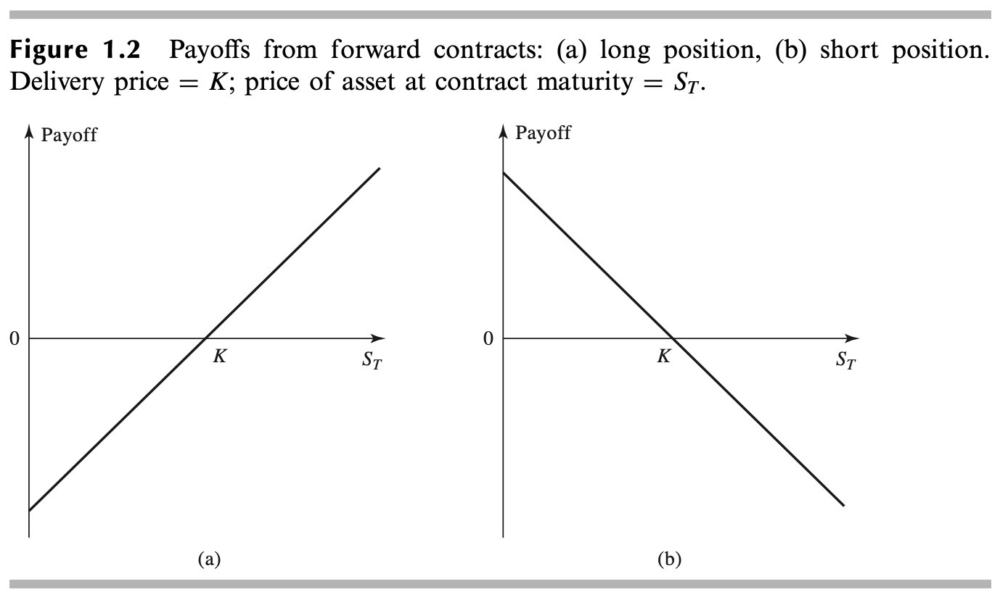
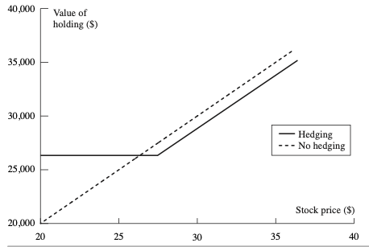
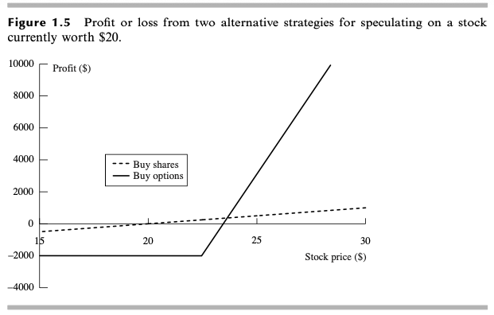
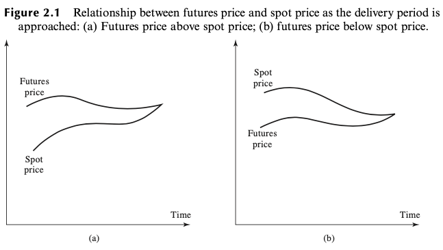
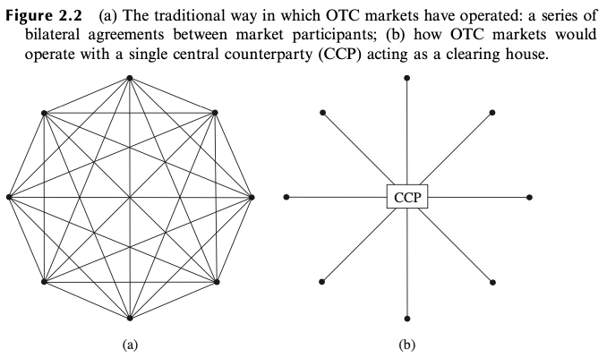
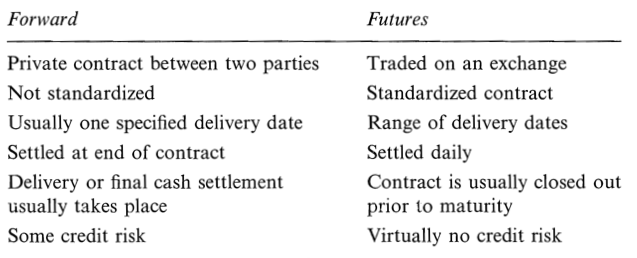

# FID-Notes

# 1. Preface

- Derivative & Subject Matter

  有基本变量派生的产品，价格可以依赖于**任何变量**

### 1.1 交易所市场 Exchange Market

- 交易所标准化之后的衍生品
  - 期货合约（将至合约 to-arrive contract）：直接交易合约的替代
  - 期权合约：外汇、期货合约、股票和股指
- 电子交易
  - 替代交易所的公开喊价系统（open-outcry system）
  - 算法交易

### 1.2 场外市场 Over-The-Counter Market OTC 

- participants：
  - 两家金融机构或金融机构P和其客户
  - 金融机构：流行产品的做市商market maker
    - 提供bid price和offer price
- 合约灵活但是存在对手信用风险
- 市场规模：OTC远大于交易所
  - OTC交易产品的面值和价值区分

### 1.3 远期合约 Forward Contract

- 简单衍生品

  在未来某一时刻以约定的价格买入或者卖出某一产品的合约

- 与即期合约Spot Contract对应

- Long Position and Short Position: Buyer and Seller

- 流行产品（标的物）：外汇

  - Future Price - Spot Price - Interest Rates of two currencies.
  - Hedge Foreign Currency Risk

#### 1.3.1 Payoffs from Forward Contracts

- Pay off for who holds ==Long Position==: 
  $$
  S_T - K
  $$

  - K: delivery price 合约规定的交割时的价格
  - $$S_T$$: 合约到期时的市场价格
  - LP必须以==价格K==买入==价值 (Worth)$$S_T$$==的asset

- Pay off for who holds ==Short Position==: 
  $$
  K - S_T
  $$
  
- 如果签订合约无需费用：Zero-Sum Game

  

#### 1.3.2 Forward Prices and Spot Prices

考虑远期利息

### 1.4 期货合约 Futures Contract

与Forward Contract区别：trade on exchange

- Standardized
- 不知道交易对手
- Mechanism

### 1.5 期权 Options

- on exchange and OTC

- 期权合约往往是有费用的、持有者可以不行权

- Types:

  - Call Option 看涨期权/认购期权

    在VT能以特定价格==买入==资产 

  - Put Option 看跌期权/认沽期权

    在VT能以特定价格==卖出==资产 

  - 合约中的特定价格：Exercise Price / Strike Price

  - VT：到期日或者期限 （Expiration Date / Maturity）
  
- American Option:

  - 在Expiration Date之前的任何时间都可以行权
  - 居多

- European Option:

  - 只能在Expiration Date行权

- Properties
  - Exercise Price goes up; Call Option Price decreases;
  - Exercise Price goes up; Put Option Price increases;
- Participants:
  1. Buyers of Calls
  2. Sellers of Calls
  3. Buyers of Puts
  4. Sellers of Puts

## 1.6 交易员的类型 Traders

- Hedger 

  利用衍生平合约来减低自己面临的由于市场变化产生的风险

- Speculator

  利用衍生品对今后的市场变量走向下赌注

- Arbitrator

  在两个或者多个工具中进行相互抵消的交易来锁定收益

## 1.7 对冲交易员 Hedger 

### 1.7.1 远期对冲 Hedging Using Forward Contract

- Options帮助锁定收益/支出	
  - 不对冲时收益可能更好或更差
  - 对冲为了降低风险，实际结果并不能更好

### 1.7.2 期权对冲 Hedging Using Options

- 实际市场价格低于期权约定价格时，行权避免过高损失。

  

### 1.7.3 比较

- Forward: 通过设定买入和卖出的资产价格进行对冲
- Options: 提供价格保险

## 1.8 Speculators

建立postion，对资产的价格上涨或者下跌下注

### 1.8.1 Speculation Using Futures

- 期货市场可以使投机者取得杠杆，少量的保证金就能建立大的投机Position

### 1.8.2 Speculation Using Options

- 与即期市场比，放大收益，同时可能损失全部投资

  

### 1.8.3 比较

- 同为杠杆
  - 期货放大损失和收益
  - 期权最大损失为期权承约费用

## 1.9 套利者 ArbitraGEURS

- 通过同时进行两种或跟多的交易来锁定无风险盈利
  - 资产的futures价格和即期市场价格不协调时产生套利机会
- 套利行为会减少套利机会
- 由于套利者的存在，大多是金融市场中只会存在很小的套利机会
  - 大多数Futures, Forwards Contract, Options都是无套利机会的。

## 1.10 Dangers

- 衍生品的复杂性使得instrument目的的不确定性
  - trader有意无意或成为投机者
- 控制衍生品的交易机制
  - 用于指定目的
  - 建立风险额度
- "What can go wrong?"
- "If it does go wrong, how much will we lose?"

# 2. Futures Markets and Central  Counterparties   期货市场和中央交易对手

## 2.1 Background  

- 期货价格也是买房和卖方的供求关系体现

### 2.1.1 Closing Out Positions 平仓

- Closing out a position means entering into the opposite trade to the original one.

  平仓就是承约一个与初始交易Position相反的Position
  
- 不交割：总损益 = ± (平仓日期货价格 - 签订日期货价格)

- 交割：总损益 = ± (即期价格 - 签订日期货价格)

## 2.2 Specification OF A Futures Contract

### 2.2.1 The Asset

- 资产为商品：资产登记规定
- 标的为金融资产：期限问题

### 2.2.2 Contract Size

- 定义交割资产的数量
  - 太大：持有小规模position的交易对手难以进行交易
  - 太小：交易成本的overhead太高
- 合约取决于潜在的客户需求
  - 农产品：asset价值 10k-20k USD
  - 金融产品：1000k

### 2.2.3 Delivery Arrangement

- 交易所指定的地点
- 其他地点的交割价格与到产地的距离正相关

### 2.2.4 Delivery Months

- 交割区间一般为整个月
- 交易所上市的期货合约只包含最近交割月的和其后的合约
- 交易所指定每个月合约开始和结束的交易日（交割日期的前几天将停止交易）

### 2.2.5 Price Quotes

### 2.2.6 Price Limits and Position Limits

- Price Limits： 交易所涨跌停
- Position Limits：投资者最大可持有的合约数量

## 2.3 CONVERGENCE OF FUTURES PRICE TO SPOT PRICE   期货价格收敛到即期价格

- Delivery period中，futures price > spot price:

  1. 卖出高价的Short Futures Contract
  2. 买入低价的Assets
  3. 等待交割套利

  - Profit: Futures Price - Spot Price

    => short futures 更多承约

    => futures price下跌

- Vice Versa

  

## 2.4 THE OPERATION OF MARGIN ACCOUNTS  保证金账户

期货交易风险：退出交易、承约能力。交易所通过保证金账户机制规避违约风险。

### 2.4.1 Daily Settlement 每日结算

- 投资者从最初开仓交易时以合约为单位存初始保证金Initial Margin到Margin Account 
- 每日结算 == Marketing to Market: 每个交易日结束时，Margin Account的金额数量都会得到调整，反映投资者盈亏
- CALLer 当前保证金 = 上个交易日保证金 + (FuturePrice - SpotPrice) × TotalFutureSize
- Long & Short Postition的保证金总和不变
- Maintenance Margin：当Margin Account低于Maintenance Margin时，投资者收到MarginCall，缴纳Variation Margin已达到Initial Margin. 否者合约被平仓
- 与spot market相比，future market具有对称性：多头和空头的承约是对等的

### 2.4.3 The Clearing House and Its Members

- Clearing House: Intertmediary
  - 记录每天的交易记录，计算每个结算会员的net position
  - 非会员必须通过会员开展业务员，在会员处缴纳保证金
- Clearing House要求会员提供初始结算保证金，反映了需要结算的所有合约的总数量
  - 没有维持保证金的要求
  - 会员处理的交易盈亏后，清算中心增减保证金

### 2.4.4 Credit Risk

保证funds可以支付traders的营收

## 2.5 OTC Market

场外交易没有margin sys，需要别的机制规避Credit Risk

### 2.5.1 Central Counterparties 中央交易对手 CCP

- CCP是OTC的Clearing House
- CCP Members 对应 Clearing House Members：Initial Margin和Daily Variation Margin； Guaranty Fund
- CCP同时是同一产品交易双反的交易对手
  - 在Maturity Date按照Price买入Asset
  - 卖出Asset
  - ==同时承担双方的信用风险==
- Business：
  - Members' Initial Margin
  - Value transactions
  - Payments and Charge DVM
- 非CCP Member通过CCP进行OTC交易

### 2.5.2 Bilateral Clearing 双边结算

- CCP\Clearing House是一种centralized transaction model

- 不能通过CCP的结算产品需要通过P2P的双边结算

- 通过双方签署覆盖二者所有交易的主协议完成：Credit Support Annex CSA 信用支持附件

  - CSA要求双方提供抵押品Collateral，类似于CCP的Margin
  - CSA要求每日交易定价从而增减Margin

- Collateral减少了信用风险

  

  

### 2.5.3 Futures Trades & OTC Trades 结算方式差异

- Futures Trade Clearing House要求现金保证金，每日结算，为初始保证金提供利息
- OTC的CCP\CSA 不是每日结算，利用Collateral抵押，不会赚取利息
  - Collateral常常是各种Security
  - Security的抵押金额不如其市值，降低的数量为Haircut

## 2.6 Market Quotes   市场报价

- Table Top:

  - Underlying Assets 标的资产
  - Contract Size 合约规模
  - Price Quote Way 报价方式（单位）

- Table Schema  ==on a trade day==

  | Assets                | Contract Size | Unit |      |                  |            |        |        |
  | --------------------- | ------------- | ---- | ---- | ---------------- | ---------- | ------ | ------ |
  | Maturity Date (Month) | Open          | High | Low  | Prior Settlement | Last Trade | Change | Volume |

### 2.6.1 Prices

- 一个交易日内
  - Open 开盘价，交易开始后立即成交的合约价格
  - High 最高价
  - Low 最低价

### 2.6.2 Settlement Price 结算价格

- Prior Settlement：上一个交易日的合约结算价格

  - 结算价格Settlement Price：

    每个交易日最后成交的合约价格，用于清算每天的盈亏和保证金数量

- Last Trade: 最新的成交价格

- Change: Last Trade - Prior Settlemet，作用在Margin上

### 2.6.3 Trading Volume and Open Interest

- Volume: 前一个交易日成交的对应合约总量

- Open Interest: the number of contracts outstanding 

  未平仓的合约数量=空头合约的总和=多头合约的总和

### 2.6.4 Patterns of Futures

- 根据Underlying Assets的种类和特性
  - Normal Market: Settlement Price是Maturity的增函数
  - Inverted Market: Settlement Price是Maturity的减函数 
  - 混合：不同Maturity阶段的增减性质不一样

## 2.7 Delivery 交割

交割的可能性决定了最终期货的价格。

合约中会规定：

- First Notice Day: 可以向交易所提交交个意向的第一天。
- Last Notice Day: 可以向交易所提交交个意向的最后一天。 
- Last Trading Day: 最后的可交易日

为了避免接收交割的风险，Long Position Holder必须在First Notice Day之前平常合约。

### 2.7.1 Cash Settlement 现金结算

某些金融期货（e.g. 股指期货）结算方式为现金，合约中指定的结算价格是某个交易日的开盘/收盘spot price，导致直接交割几乎不会发生。

## 2.8 Types of traders and orders 交易员和交易指令的类型

- Futures Commission Broker (FCM)：期货佣金经纪人

  执行他人的交易指令收取佣金

- Local：自营经纪人

  用自身账户的资金交易

- Position Holder：
  - Hedger
  - Speculator
    - Scalper 短期投机者 minute-level
    - Day Trader 短线交易员 within one day
    - Position Trader 头寸交易员 macro market trend
  - Arbitrageurs

### 2.8.1 Orders 指令

- Market Order：以当前市场最好的价格（market price）马上进行交易
- Limit Order：给定一个交易价格，IFF market price达到改价格或优于改价格时执行交易指令 （Trigger）
- Stop Order aka. Stop-Loss Order：market price达到或劣于给定价格时执行（作为Market Order挂牌）
- Stop-Limit Order：SO封装LO，SO触发时转变为LO（双向Trigger）

## 2.11 Forward vs. Futures Contracts

### 2.11.1 Profits

- Forward：Profit只在合约到期时进行结算和实现
- Future：Daily Settlement使得Profit每日结算和实现
  - Profit分布在持有合约的每一天

### 2.11.2 FX Quotes

在Future和Forward市场上的汇率报价不同。

# 3. Hedging Strategies Using Futures

- Long\Short Position的抉择
- Contract的制定
- 最佳Position的制定
- hedge-and-forget strategy：静态策略
- dynamic hedging strategy
- Forward与Future：通过Trailing（an adjustment）进行调节转换。

## 3.1 Basic Principles

